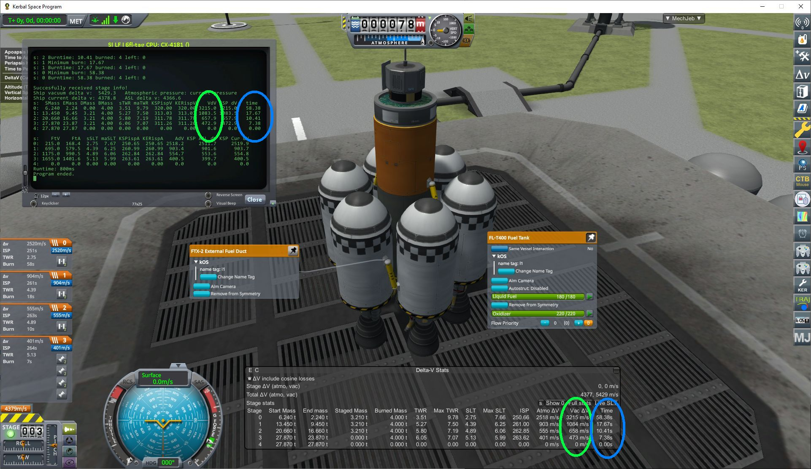

# kOSutil
Repository with files and utilities for the [kOS mod](https://github.com/KSP-KOS/KOS) for Kerbal Space Program.

## Contents
The following topics are currently addressed:

### Library to provide extended staging information
The user interface of KSP provides information about Delta V, ISP, Thrust, TWR, Start/End Mass and
Burn Time, but kOS **only** makes the
[Delta V information per stage](https://ksp-kos.github.io/KOS/structures/vessels/deltav.html) available.
The ``sinfo.ks`` library recalculates those and other values and provides access to the values via a
list/lexicon structure. The values match those provided through Kerbal Engineer Redux, or MechJeb.

#### Files
- ``sinfo.ks``        Main library file providing the ``sinfo()`` function.
- ``sitest.ks``       A test script to demonstrate the ``sinfo()`` usage.
- ``sinfo_no_fd.ks``  A legacy version that does **not** support _fuel ducts_.

The ``sinfo()`` function accepts a parameter to define the atmospheric pressure for in atmosphere values or
to use the current pressure around the vessel.
 
Caveats:
* Air breathing engines are not considered and might break the script.
* Fuel Ducts are implemented but need some additional input because [kOS does not provide the target information of the part](https://github.com/KSP-KOS/KOS/issues/1974) is needed. Two methods are used to tell the script where fuel ducts go:
  1. Add matching kOS tags to the fuel duct and the target object. (See figure 1 below)
  2. If no suitable tags are found, the library assumes the other side of the decoupler that drops the part or group of parts where the fuel duct is attached to as the target of the fuel duct. This works in simple cases, but the asparagus staging example from figure 1 needs tags to assist the sinfo library.
* The library is not tested with non-stock parts.

The following values are currently returned for each stage in the form ``returnvar[stage]:key``, with
the following keys and their meaning:
```
SMass   .. startmass
EMass   .. endmass.
DMass   .. stagedmass.
BMass   .. fuel burned
sTWR    .. start TWR
maxTWR  .. max TWR
sSLT    .. start SLT (Sea level thrust)
maxSLT  .. max SLT
FtV     .. thrust in vacuum
FtA     .. thrust at atmospheric pressure
KSPispV .. ISPg0 KSP - vacuum
KERispV .. ISPg0 Kerbal Engineer Redux - vacuum
KSPispA .. ISPg0 KSP - at atmospheric pressure
KERispA .. ISPg0 Kerbal Engineer Redux - at atmospheric pressure
VdV     .. Vacuum delta V
AdV     .. Atmospheric delta V (see atmo parameter)
dur     .. burn duration
// The following key is the same for all stages:
ATMO    .. Atmospheric pressure used for thrust calculation
```

</img> </img>
**Figure 1:** (left) Vessel in the VAB with KER readout and showing kOS tags. (right) Vessel showing staging information after executing sitest.ks and also showing MechJeb vessel information for comparison.

The ``sinfo.ks`` library can be tested by running the ``sitest.ks`` test script.

### Multi-stage maneuver execution script
The ``xm2.ks`` script uses the ``sinfo.ks`` library to calculate the cummulative burn time across multiple
stages to time the beginning of the burn for the maneuver. This is something that the user interface from
KSP provides, but that otherwise is not available through kOS.
The script times the ignition so that one half of the Delta V is applied before the maneuver time (``node:ETA``) and
the other half after.

### Library of frequently used functions
The ``libcommon.ks`` library contains functions that are used by the scripts and libraries above. 
The following function is provided:
```
nuform(nmber,lead,precision)  A function to format a string from a number
                              with leading characters and trailing digits.
```
## Use
All code is considered "as is" and might fail anytime. Protect your Kerbals!

## Licensing
Permission is granted to change, share, and use the content of this repository under the terms of the [MIT license](LICENSE).

