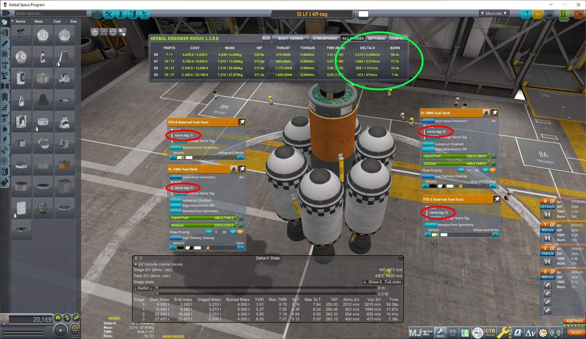
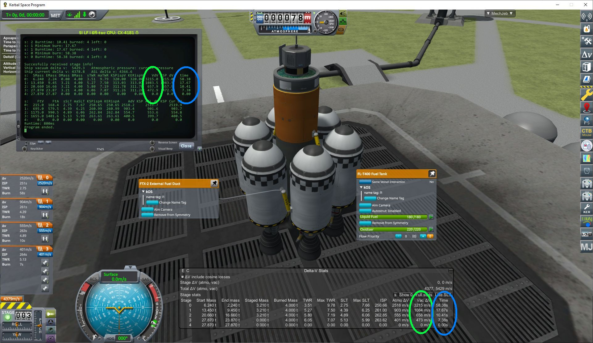

# Documentation for extended staging information library (sinfo())

The user interface of KSP provides information about Delta V, ISP, Thrust, TWR, Start/End Mass and
Burn Time, but kOS **only** makes the
[Delta V information per stage](https://ksp-kos.github.io/KOS/structures/vessels/deltav.html) available.
The ``sinfo.ks`` library recalculates those and other values and provides access to the values via a
list/lexicon structure. The values match those provided through Kerbal Engineer Redux, or MechJeb.

The library supports the use of fuel ducts in the vessel when calculating the staging information.

#### Files
- ``sinfo.ks``        Main library file providing the ``sinfo()`` function.
- ``sitest.ks``       A test script to demonstrate the ``sinfo()`` usage.
- ``sinfo_no_fd.ks``  A legacy version that does **not** support _fuel ducts_.

#### sinfo function
Calculates and returns extended staging information.

##### Arguments:
```
1) atmo:  Optional - Sets the atmostpheric pressure to be used.
          Allowed values:
            any non scalar (default) Any non number value makes the function to use the pressure
                           at the current location of the vessel.
            0 to 100       A numeric value of zero to 100 sets the atmostpheric pressure to this
                           value in atmospheres.
```
##### Return value:
```
On failure: 0 (integer value)
On success: A list of lexicons with one lexicon entry per stage with the following keys.
            (format returnvar[stage]:key):
  SMass   .. startmass
  EMass   .. endmass.
  DMass   .. stagedmass.
  BMass   .. fuel burned
  sTWR    .. start TWR
  maxTWR  .. max TWR
  sSLT    .. start SLT (Sea Level Thrust)
  maxSLT  .. max SLT
  FtV     .. thrust in vacuum
  FtA     .. thrust at atmospheric pressure
  KSPispV .. ISPg0 KSP - vacuum
  KERispV .. ISPg0 Kerbal Engineer Redux - vacuum
  KSPispA .. ISPg0 KSP - at atmospheric pressure
  KERispA .. ISPg0 Kerbal Engineer Redux - at atmospheric pressure
  VdV     .. Vacuum delta V
  AdV     .. Atmospheric delta V (see atmo parameter)
  dur     .. burn duration
  ATMO    .. Atmospheric pressure used for thrust calculation (same value in all stages)
```

#### Requirements and Usage
The function simulates the fuel consumption and thrust, more on that below, to calculate the Delta V (this implies knowing ISP and mass) available for each of the stages. Some assumptions are made as laid out below. Violation of these requrements will likely lead to incorrect staging information or an error message.
* **Fuel Ducts** need some additional preparations and precautions:
  * Use [kOS tags](https://ksp-kos.github.io/KOS/general/nametag.html) to mark the target of the duct. Assigning the same _tag_ to the fuel duct and the target it attaches to will tell the function where it connects to. See also Figure 1 (left) below. This is needed because kOS does [not provide the target information of the part](https://github.com/KSP-KOS/KOS/issues/1974) that the duct connects to.
  * If no suitable tags are found, the function assumes the other side of the decoupler that drops the part or group of parts where the fuel duct is attached to as the target of the fuel duct. This works in simple cases, but the asparagus staging example from Figure 1 needs tags to assist the sinfo library.
* **Only one** fuel duct **leading out** of a _fuel zone_ (group of tanks and engines) into another target group is supported. No such limit is imposed on **incoming** fuel ducts into a [_fuel zone_](#Engine-groups-or-fuel-zones). This is a limitation of the underlying framework. 
* The function assumes that the group that the duct leads out (_source_) is **decoupled earlier** than the group the duct targets to (_target_). This assures that the **_source_ is drained completely before drawing fuel from the _target_**. This is KSP's default behavior, unless the flow priority of the tanks is changed - be careful!
* **Flow Priority** of the tanks is not considered when simulating the fuel usage, but might lead to unexpected results when altered.

#### Caveats
* Air breathing engines are not considered and might break the function.
* Solid Rocket Boosters within the same [_fuel zone_](#Engine-groups-or-fuel-zones) need to be of the same type with the same thrust, consumption rate and fuel mass.
* The library is not tested with non-stock parts.

#### Figures
</img> </img>
**Figure 1:** (left) Vessel in the VAB with KER readout and showing kOS tags. (right) Vessel showing staging information after executing sitest.ks and also showing MechJeb vessel information for comparison.

### Under the hood
This section will describe the method to calculate the staging information.

The calculation of Delta V requires the knowledge of fuel consumption and thrust (this implies ISP and mass). The function calculates this and related information for every stage of the vessel.

#### Engine groups or fuel zones
The function looks at every part of the vessel and groups them together when crossfeed is enabled between touching parts. That means all parts in one of those groups have access to all the fuel in this group. The exception from this are SRBs, they do not _share_ their own fuel, but allow for crossfeed and connect other parts in the same group.

Defining engine groups allows to track fuel, fuel consumption and thrust per engine group.

#### Staging
For stages with decouplers, KSP (and this function) assumes that it will immediately stage after all active engines connected to this decoupler are out of all available fuel.

#### Tracking changes when a stage is activated - burning
To be continued ...

#### Fuel Ducts


